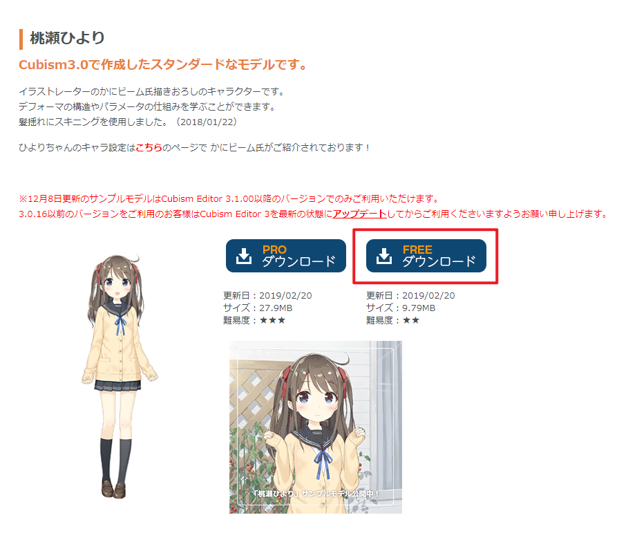
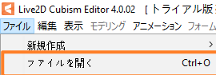
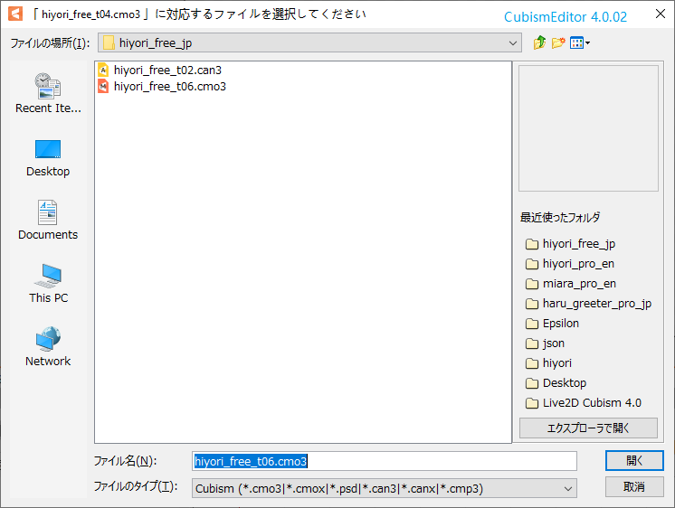
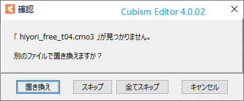
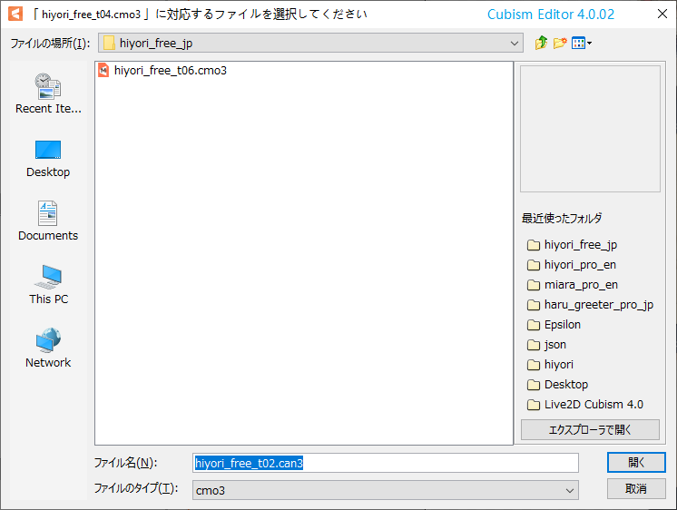
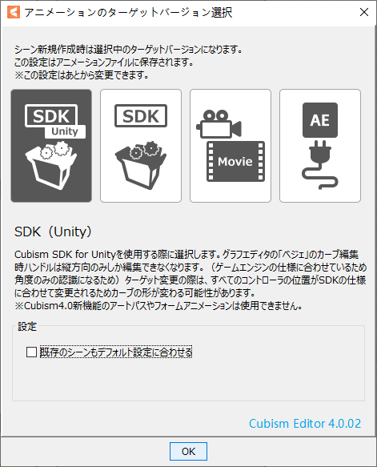
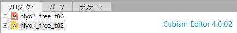

# 制作在Unity中使用的Live2D动画

2019-12-02

1. 下载[官方模板](https://docs.live2d.com/cubism-editor-manual/sample-model/)中的桃瀬ひより

    >  

2. 依次打开com3(模型文件)和can3(动画文件)  

    >  
    >  
    >
    >当使用的模板动画版本与模型版本不对应时，会出现如下界面  
    >
    >  
    >
    >选择\[置き換え\],手动选择替换文件  
    >
    >  
    >
    >Tips:开启动画文件时找不到原本的模型文件应该是官方更新了模型文件但是没有更新动画文件所致，由于不同版本的模型文件是迭代关系，所以绑定旧模型的动画文件可以直接使用新版模型文件  
    >
    >替换完成后，会开启选择SDK的面板，这里选择SDK(Unity)  
    >
    >  
    >
    >开启完成后，项目(プロジェクト\\Project)视图里应该应该有这两个东西了  
    >
    >  

3. 