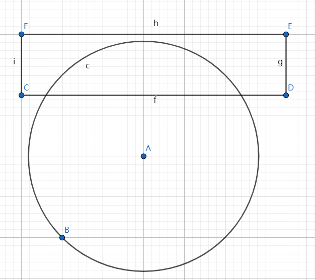
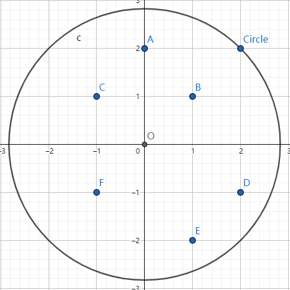
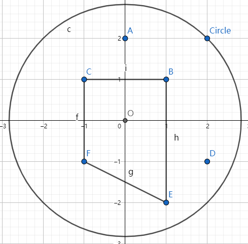
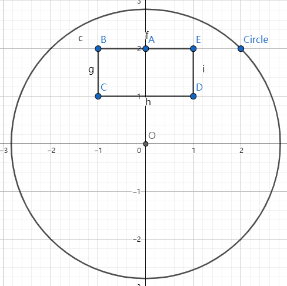
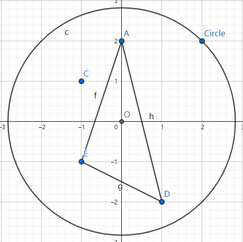
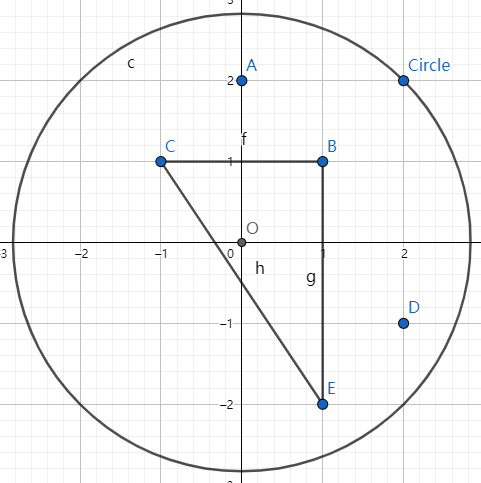
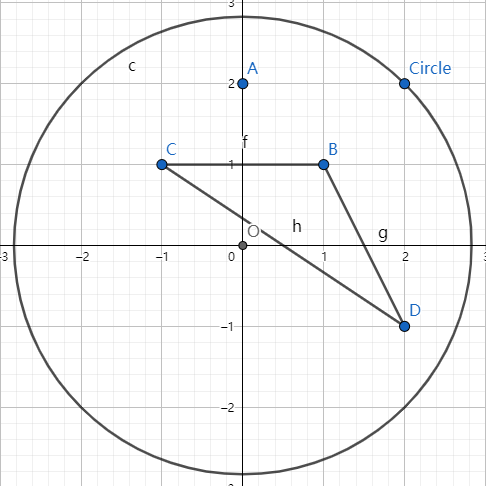
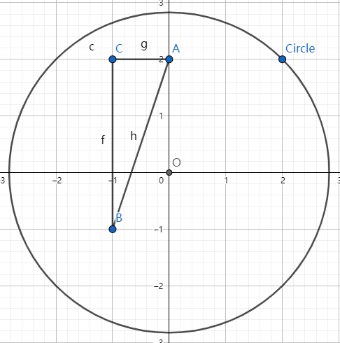
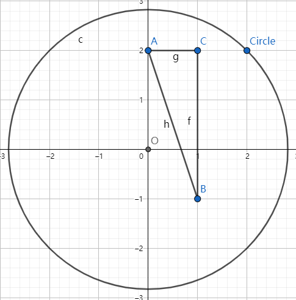
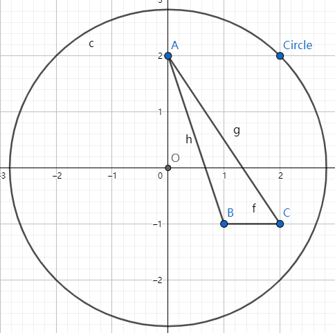

# Unity中判断某个点是否被其他点包围  

在圆柱体切削算法中，在获取到某个截面的所有切割点后，无法直接拿切割点和圆柱中线距离作为切割判断依据，因为存在切割点包围中线和没包围中线两种情况。  

算法前提是刀具模型为非凹体。  

## 需求分析  

当切割点没有包围圆柱中线时，只需求出所有点连线与中线最短的距离和所有点中里中线最远的距离，即可求出需要切削的环形的大小。  

  

当切割点包围了圆柱中线时，只需要求出所有点中里中线最远的距离，即可求出需要切削的圆的大小。  

## 判断方法  

1. 首先构建坐标系  
      
    从所有点中随意取一个与中线不重合的点，如图中的A,以中线点O为原点，以OA为y轴方向构建平面直角坐标系。  
2. 四个象限都分布点的情况  
      
    当四个象限都存在点时，则这些点必定包围原点  
3. 仅一二象限有点的情况  
      
    当仅一二象限有点时，则必定没有包围原点  
4. 三四象限有点的情况  
      
    当三四象限有点时，这些点与A点必定可以包围原点，一二象限的点无需判断  
5. 仅包括一二象限的三个象限有点  
    当仅三个象限有点时（包括一二象限），存在两种情况  
    * 情况1  
            
          这种情况下包围原点。  
    * 情况2  
            
          这种情况下不包围原点。  
    判断方法：  
      
    经过原点在相对象限的点的连线上做垂线，获得垂足与原点的连线OE，判断OE与OA的角度，大于九十度时包围，反之则不包围。  

6. 其他情况  
    * 仅二三象限有点  
            
    * 仅一四象限有点  
            
    * 仅一个象限有点  
            
    以上三种情况，都是必然不包围原点的。  
    此外还有点在轴上的情况，在对精度要求不大的前提下，可以近似的认为其不在轴上。  

## 具体算法  

balabalabala  
