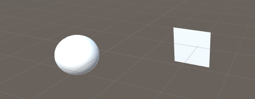
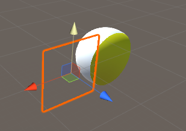
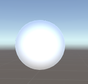
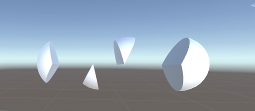
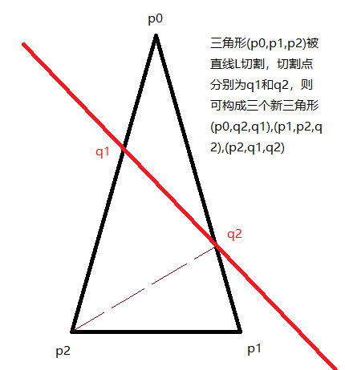

# Unity中的模型切割  

## 仅使用shader的切割

1. 新建一个被切割的Sphera和一个用来控制切割面的Quad  


2. 新建C#脚本ModelClip挂载到Sphera上，quad变量拖拽选择Quad对象  

    ``` C#
    public class ModelCutLab : MonoBehaviour {
        [SerializeField]
        private Transform quad;

        private Material mesh;
        private void Awake()
        {
            mesh = GetComponent<MeshRenderer>().material;
        }

        private void Update()
        {
            //新建Plane对象，传入quad的法线向量和世界坐标（一个点和一个法向量确定一个面）
            Plane cut = new Plane(quad.forward, quad.position);

            //cut.normal为平面的法线向量（此时和quad.forward完全相等）
            //cut.distance为世界原点到平面的距离（点到面距离）
            //Plane指的是一个有“方向”的平面，一个点在Plane前方时，此点到面的距离为正，反之则为负
            Vector4 dealData = new Vector4(cut.normal.x, cut.normal.y, cut.normal.z, cut.   distance);

            // 传递法线与距离至shader中
            mesh.SetVector("_Clip", dealData);
        }
    }
    ```

3. 新建shader文件Clip,新建材质球选择此shader,将材质球挂载到Sphera上

    ``` Shaderlab
    Shader "TBShader/Clip" {
        Properties {
            _Color ("Color", Color) = (1,1,1,1)
            _MainTex ("Albedo (RGB)", 2D) = "white" {}
            _Metallic ("Metallic", Range(0,1)) = 0.5
            _Glossiness ("Smoothness", Range(0,1)) = 0.5
            _ClipColor ("ClipColor", Color) = (1,1,0,1)
        }
        SubShader {
            Tags { "RenderType" = "Opaque" }
            LOD 200

            Cull Back
            CGPROGRAM

            #pragma surface surf Standard noshadow
            #pragma target 3.0

            fixed4 _Color;
            sampler2D _MainTex;
            half _Metallic;
            half _Glossiness;
            uniform half4 _Clip;

            struct Input
            {
                float2 uv_MainTex;
                float3 worldPos;
                float3 viewDir;
            };

            void surf(Input IN, inout SurfaceOutputStandard o)
            {
                half distance = dot(IN.worldPos, _Clip.xyz)+ _Clip.w;
                if (-distance>0)
                {
                    fixed4 c = tex2D(_MainTex, IN.uv_MainTex) * _Color;
                    o.Albedo = c.rgb;
                    o.Alpha = c.a;
                }
                else
                {
                    discard;
                }

                o.Metallic = _Metallic;
                o.Smoothness = _Glossiness;
            }

            ENDCG

            Cull Front
            CGPROGRAM

            #pragma surface surf Standard noshadow
            #pragma target 3.0

            fixed4 _ClipColor;
            uniform half4 _Clip;

            struct Input
            {
                float3 worldPos;
            };

            void surf(Input IN, inout SurfaceOutputStandard o)
            {
                half distance = dot(IN.worldPos, _Clip.xyz)+ _Clip.w;
                if (-distance>0)
                {
                    o.Albedo = _ClipColor.rgb;
                    o.Alpha = _ClipColor.a;
                }
                else
                {
                    discard;
                }
            }
            ENDCG
        }
        FallBack "Standard"
    }

    ```

4. 此时在编辑器中运行，拖动和旋转Quad至合适位置，即可观察到Sphera被切割  


5. 其中核心的计算为

    ``` Shaderlab
    half distance = dot(IN.worldPos, _Clip.xyz)+_Clip.w;
    ```

dot(IN.worldPos,_Clip.xyz)即像素点坐标点乘切割平面的法向量，可以求出当前像素点坐标在切割平面法向量上的投影（以世界坐标为原点），再加上_Clip.w，即可求出像素点离切割平面的距离，当距离为负时在切割平面前面，反之则在后面，在切割平面后面的像素点不进行渲染即可完成模型切割特效  

## 修改模型顶点的切割

1. 在场景中添加一个用于被切割的Sphera  


2. 新建脚本RealCut如下，挂载脚本到球体上

    ``` C#
    using System;
    using System.Collections.Generic;
    using UnityEngine;

    /// <summary>
    /// 模型切割脚本，仅能在切面图形非凹时正常使用
    /// </summary>
    public class RealCut : MonoBehaviour
    {
        private Vector3 touchBeganPos;
    
        private Plane clipPlane;
    
        private void Update()
        {
            if (Input.GetMouseButtonDown(0))
            {
                touchBeganPos = Input.mousePosition;
            }
            else if (Input.GetMouseButtonUp(0))
            {
                Vector3 touchBeganPoint_screen = new Vector3(touchBeganPos.x, touchBeganPos.y,     Camera.main.nearClipPlane);
                Vector3 touchEndPoint_screen = new Vector3(Input.mousePosition.x, Input.    mousePosition.y, Camera.main.nearClipPlane);
                Vector3 normalEndPoint_screen = new Vector3(touchBeganPos.x, touchBeganPos.y, Camera.    main.nearClipPlane + 10);
    
                if (UpdateClipPlane(touchBeganPoint_screen, touchEndPoint_screen,     normalEndPoint_screen))
                {
                    ClipMesh();
                }
            }
        }
    
        /// <summary>
        /// 判断鼠标按下后是否进行了移动，在移动的情况下，更新切割面的法线和点
        /// </summary>
        /// <param name="touchBeganPoint_sceen"></param>
        /// <param name="touchEndPoint_sceen"></param>
        /// <param name="normalEndPoint_screen"></param>
        /// <returns></returns>
        private bool UpdateClipPlane(Vector3 touchBeganPoint_sceen, Vector3 touchEndPoint_sceen,     Vector3 normalEndPoint_screen)
        {
            if (Vector3.Distance(touchBeganPoint_sceen, touchEndPoint_sceen) == 0.0f)
            {
                return false;
            }
    
            //屏幕坐标转世界坐标
            Vector3 touchBeganPoint_world = Camera.main.ScreenToWorldPoint(touchBeganPoint_sceen);
            Vector3 touchEndPoint_world = Camera.main.ScreenToWorldPoint(touchEndPoint_sceen);
            Vector3 noramlEndPoint_world = Camera.main.ScreenToWorldPoint(normalEndPoint_screen);
    
            //世界坐标转本地坐标
            Vector3 touchBeginPoint_local = transform.worldToLocalMatrix.MultiplyPoint    (touchBeganPoint_world);
            Vector3 touchEndPoint_local = transform.worldToLocalMatrix.MultiplyPoint    (touchEndPoint_world);
            Vector3 normalEngPoint_local = transform.worldToLocalMatrix.MultiplyPoint    (noramlEndPoint_world);
    
            clipPlane = new Plane(Vector3.Cross(normalEngPoint_local - touchBeginPoint_local,     touchEndPoint_local - touchBeginPoint_local).normalized, touchEndPoint_local);
    
            return true;
        }
    
        private void ClipMesh()
        {
            MeshFilter mf = this.gameObject.GetComponent<MeshFilter>();
            int rawVerticeCount = mf.mesh.vertices.Length;
            List<Vector3> verticeList = new List<Vector3>(mf.mesh.vertices);
            List<int> triangleList = new List<int>(mf.mesh.triangles);
            List<Vector2> uvList = new List<Vector2>(mf.mesh.uv);
            List<Vector3> normalList = new List<Vector3>(mf.mesh.normals);
    
            bool sideFlag = false;
            for (int i = 0; i < triangleList.Count; i+=3)
            {
    
                if (clipPlane.GetSide(verticeList[triangleList[i]]) ^ clipPlane.GetSide(verticeList    [triangleList[i+1]]) == true)
                {
                    sideFlag = true;
                    break;
                }
                else if(clipPlane.GetSide(verticeList[triangleList[i]]) ^ clipPlane.GetSide    (verticeList[triangleList[i+2]]) == true)
                {
                    sideFlag = true;
                    break;
                }
                else if (clipPlane.GetSide(verticeList[triangleList[i+1]]) ^ clipPlane.GetSide    (verticeList[triangleList[i+2]]) == true)
                {
                    sideFlag = true;
                    break;
                }
            }
            if (sideFlag == false)
            {
                //模型的所有点在切割面的一侧,不执行后续步骤
                return;
            }
            int newPointCount = 0;
    
            //切割所有三角形
            for (int triangleIndex = 0; triangleIndex < triangleList.Count;)
            {
                int trianglePointIndex0 = triangleList[triangleIndex];
                int trianglePointIndex1 = triangleList[triangleIndex + 1];
                int trianglePointIndex2 = triangleList[triangleIndex + 2];
    
                Vector3 trianglePointCoord0 = verticeList[trianglePointIndex0];
                Vector3 trianglePointCoord1 = verticeList[trianglePointIndex1];
                Vector3 trianglePointCoord2 = verticeList[trianglePointIndex2];
    
                Vector2 uv0 = uvList[trianglePointIndex0];
                Vector2 uv1 = uvList[trianglePointIndex1];
                Vector2 uv2 = uvList[trianglePointIndex2];
    
                Vector3 normalX0 = normalList[trianglePointIndex0];
                Vector3 normalX1 = normalList[trianglePointIndex1];
                Vector3 normalX2 = normalList[trianglePointIndex2];
    
                //0-1，1-2相连线段被切割
                if (clipPlane.GetSide(trianglePointCoord0) ^ clipPlane.GetSide(trianglePointCoord1)     == true &&
                    clipPlane.GetSide(trianglePointCoord1) ^ clipPlane.GetSide(trianglePointCoord2)     == true)
                {
                    newPointCount++;
                       //求得0-1与切平面的交点
                       Vector3 newVertice01 = (Vector3)GetLinePlaneCrossPoint(trianglePointCoord0,     trianglePointCoord1, clipPlane);
                    verticeList.Add(newVertice01);
                    int index01 = verticeList.Count - 1;
                    float k01 = (newVertice01 - trianglePointCoord0).magnitude /     (trianglePointCoord1 - trianglePointCoord0).magnitude;
                    uvList.Add(Vector2.Lerp(uv0, uv1, k01));
                    normalList.Add(Vector3.Lerp(normalX0, normalX1, k01));
    
                    //求得1-2与切平面的交点
                    Vector3 newVertice12 = (Vector3)GetLinePlaneCrossPoint(trianglePointCoord1,     trianglePointCoord2, clipPlane);
                    verticeList.Add(newVertice12);
                    int index12 = verticeList.Count - 1;
                    float k12 = (newVertice12 - trianglePointCoord1).magnitude /     (trianglePointCoord2 - trianglePointCoord1).magnitude;
                    uvList.Add(Vector2.Lerp(uv1, uv2, k12));
                    normalList.Add(Vector3.Lerp(normalX1, normalX2, k12));
    
                    //删除原来的顶点索引，插入新的顶点索引，以此构建三个新三角形
                    triangleList.RemoveRange(triangleIndex, 3);
    
                    triangleList.Insert(triangleIndex + 0, trianglePointIndex0);
                    triangleList.Insert(triangleIndex + 1, index01);
                    triangleList.Insert(triangleIndex + 2, index12);
    
                    triangleList.Insert(triangleIndex + 3, index12);
                    triangleList.Insert(triangleIndex + 4, index01);
                    triangleList.Insert(triangleIndex + 5, trianglePointIndex1);
    
                    triangleList.Insert(triangleIndex + 6, trianglePointIndex0);
                    triangleList.Insert(triangleIndex + 7, index12);
                    triangleList.Insert(triangleIndex + 8, trianglePointIndex2);
    
                    triangleIndex += 9;
                }
                //1-2，2-0相连线段被切割
                else if (clipPlane.GetSide(trianglePointCoord1) ^ clipPlane.GetSide    (trianglePointCoord2) == true &&
                    clipPlane.GetSide(trianglePointCoord2) ^ clipPlane.GetSide(trianglePointCoord0)     == true)
                {
                    newPointCount++;
                    //求得1-2与切平面的交点
                    Vector3 newVertice12 = (Vector3)GetLinePlaneCrossPoint(trianglePointCoord1,     trianglePointCoord2, clipPlane);
                    verticeList.Add(newVertice12);
                    int index12 = verticeList.Count - 1;
                    float k12 = (newVertice12 - trianglePointCoord1).magnitude /     (trianglePointCoord2 - trianglePointCoord1).magnitude;
                    uvList.Add(Vector2.Lerp(uv1, uv2, k12));
                    normalList.Add(Vector3.Lerp(normalX1, normalX2, k12));
    
                    //求得0-2与切平面的交点
                    Vector3 newVertice02 = (Vector3)GetLinePlaneCrossPoint(trianglePointCoord0,     trianglePointCoord2, clipPlane);
                    verticeList.Add(newVertice02);
                    int index02 = verticeList.Count - 1;
                    float k02 = (newVertice02 - trianglePointCoord0).magnitude /     (trianglePointCoord2 - trianglePointCoord0).magnitude;
                    uvList.Add(Vector2.Lerp(uv0, uv2, k02));
                    normalList.Add(Vector3.Lerp(normalX0, normalX2, k02));
    
                    //删除原来的顶点索引，插入新的顶点索引，以此构建三个新三角形
                    triangleList.RemoveRange(triangleIndex, 3);
                    triangleList.Insert(triangleIndex + 0, trianglePointIndex0);
                    triangleList.Insert(triangleIndex + 1, trianglePointIndex1);
                    triangleList.Insert(triangleIndex + 2, index12);
    
                    triangleList.Insert(triangleIndex + 3, index02);
                    triangleList.Insert(triangleIndex + 4, index12);
                    triangleList.Insert(triangleIndex + 5, trianglePointIndex2);
    
                    triangleList.Insert(triangleIndex + 6, index02);
                    triangleList.Insert(triangleIndex + 7, trianglePointIndex0);
                    triangleList.Insert(triangleIndex + 8, index12);
                    triangleIndex += 9;
                }
                //0-1，2-0相连线段被切割
                else if (clipPlane.GetSide(trianglePointCoord0) ^ clipPlane.GetSide    (trianglePointCoord1) == true &&
                    clipPlane.GetSide(trianglePointCoord2) ^ clipPlane.GetSide(trianglePointCoord0)     == true)
                {
                    newPointCount++;
                    //求得0-1与切平面的交点
                    Vector3 newVertice01 = (Vector3)GetLinePlaneCrossPoint(trianglePointCoord0,     trianglePointCoord1, clipPlane);
                    verticeList.Add(newVertice01);
                    int index01 = verticeList.Count - 1;
                    float k01 = (newVertice01 - trianglePointCoord0).magnitude /     (trianglePointCoord1 - trianglePointCoord0).magnitude;
                    uvList.Add(Vector2.Lerp(uv0, uv1, k01));
                    normalList.Add(Vector3.Lerp(normalX0, normalX1, k01));
    
                    //求得0-2与切平面的交点
                    Vector3 newVertice02 = (Vector3)GetLinePlaneCrossPoint(trianglePointCoord0,     trianglePointCoord2, clipPlane);
                    verticeList.Add(newVertice02);
                    int index02 = verticeList.Count - 1;
                    float k02 = (newVertice02 - trianglePointCoord0).magnitude /     (trianglePointCoord2 - trianglePointCoord0).magnitude;
                    uvList.Add(Vector2.Lerp(uv0, uv2, k02));
                    normalList.Add(Vector3.Lerp(normalX0, normalX2, k02));
    
                    //删除原来的顶点索引，插入新的顶点索引，以此构建三个新三角形
                    triangleList.RemoveRange(triangleIndex, 3);
                    triangleList.Insert(triangleIndex + 0, trianglePointIndex0);
                    triangleList.Insert(triangleIndex + 1, index01);
                    triangleList.Insert(triangleIndex + 2, index02);
    
                    triangleList.Insert(triangleIndex + 3, index01);
                    triangleList.Insert(triangleIndex + 4, trianglePointIndex1);
                    triangleList.Insert(triangleIndex + 5, trianglePointIndex2);
    
                    triangleList.Insert(triangleIndex + 6, trianglePointIndex2);
                    triangleList.Insert(triangleIndex + 7, index02);
                    triangleList.Insert(triangleIndex + 8, index01);
                    triangleIndex += 9;
                }
                else
                {
                    triangleIndex += 3;
                }
            }
    
    
            //筛选出切割面两侧的三角形索引
            List<int> triangles1 = new List<int>();
            List<int> triangles2 = new List<int>();
            for (int triangleIndex = 0; triangleIndex < triangleList.Count; triangleIndex += 3)
            {
                int trianglePoint0 = triangleList[triangleIndex];
                int trianglePoint1 = triangleList[triangleIndex + 1];
                int trianglePoint2 = triangleList[triangleIndex + 2];
    
                Vector3 point0 = verticeList[trianglePoint0];
                Vector3 point1 = verticeList[trianglePoint1];
                Vector3 point2 = verticeList[trianglePoint2];
    
                float dis0 = clipPlane.GetDistanceToPoint(point0);
                float dis1 = clipPlane.GetDistanceToPoint(point1);
                float dis2 = clipPlane.GetDistanceToPoint(point2);
    
                if ((dis0 < 0 || IsNear(dis0, 0)) && (dis1 < 0 || IsNear(dis1, 0)) && (dis2 < 0 ||     IsNear(dis2, 0)))
                {
                    triangles1.Add(trianglePoint0);
                    triangles1.Add(trianglePoint1);
                    triangles1.Add(trianglePoint2);
                }
                else
                {
                    triangles2.Add(trianglePoint0);
                    triangles2.Add(trianglePoint1);
                    triangles2.Add(trianglePoint2);
                }
            }
    
            List<Vector3> normalList2 = new List<Vector3>(normalList.ToArray());
    
            int newVerticeCount = verticeList.Count - rawVerticeCount;
    
            #region 新增uv和法线不同的定点
    
            for (int newVerticeIndex = 0; newVerticeIndex < newVerticeCount; ++newVerticeIndex)
            {
                Vector3 newVertice = verticeList[rawVerticeCount + newVerticeIndex];
                verticeList.Add(newVertice);
    
                Vector2 newUv = new Vector2(0.99f, 0.99f);
                uvList.Add(newUv);
    
                normalList.Add(clipPlane.normal);
                normalList2.Add(-clipPlane.normal);
            }
    
            rawVerticeCount = rawVerticeCount + newVerticeCount;
            #endregion
    
            #region 重新排序面上的顶点
            List<SortAngle> SortAngleList = new List<SortAngle>();
            for (int verticeIndex = rawVerticeCount + 1; verticeIndex < verticeList.Count;     verticeIndex++)
            {
                //计算角度,以0-1为参照，01一定是相邻的两个点（从同一个三角形中切出的点）
                Vector3 line0to1 = verticeList[rawVerticeCount + 1] - verticeList[rawVerticeCount];
                Vector3 line0toi = verticeList[verticeIndex] - verticeList[rawVerticeCount];
    
                if (IsNear(line0toi.magnitude,0))
                {
                    continue;
                }
                float angle = Vector3.SignedAngle(line0to1.normalized, line0toi.normalized,     clipPlane.normal);
    
    
                bool isExistSameAngel = false;
                for (int i = 0; i < SortAngleList.Count; ++i)
                {
                    //同样角度，距离近的被剔除
                    if (IsNear(Mathf.Abs(SortAngleList[i].Angle - angle), 0) || IsNear( verticeList    [SortAngleList[i].Index],verticeList[verticeIndex]))
                    {
                        float dis1 = Vector3.Distance(verticeList[SortAngleList[i].Index],     verticeList[rawVerticeCount]);
                        float dis2 = Vector3.Distance(verticeList[verticeIndex], verticeList    [rawVerticeCount]);
                        if (dis2 >= dis1)
                        {
                            SortAngleList[i].Index = verticeIndex;
                        }
                        isExistSameAngel = true;
                        break;
                    }
                }
                if (!isExistSameAngel)
                {
                    SortAngle sortAngle = new SortAngle
                    {
                        Index = verticeIndex,
                        Angle = angle
                    };
                    SortAngleList.Add(sortAngle);
                }
            }
            SortAngleList.Sort();
            #endregion

            #region 缝合
             Vector3 line1 = verticeList[rawVerticeCount + 1] - verticeList[rawVerticeCount];
            Vector3 line2 = verticeList[rawVerticeCount + 2] - verticeList[rawVerticeCount];

            float angle12 = Vector3.SignedAngle(line1.normalized, line2.normalized, clipPlane.normal)   ;

            for (int verticeIndex = 0; verticeIndex < SortAngleList.Count ; verticeIndex++)
            {
                if (verticeIndex == 0&& angle12 < 0)
                {
                    continue;
                }
                if (verticeIndex== SortAngleList.Count-1&& angle12 > 0)
                {
                    continue;
                }
                int next = verticeIndex + 1;
                if (next>= SortAngleList.Count)
                {
                    next = 0;
                }
                if (Vector3.SignedAngle(verticeList[SortAngleList[next].Index] - verticeList    [rawVerticeCount], verticeList[SortAngleList[verticeIndex].Index] - verticeList [rawVerticeCount], clipPlane.normal) > 0)
                {
                    triangles1.Add(SortAngleList[next].Index);
                    triangles1.Add(SortAngleList[verticeIndex].Index);
                    triangles1.Add(rawVerticeCount);

                    triangles2.Add(rawVerticeCount);
                    triangles2.Add(SortAngleList[verticeIndex].Index);
                    triangles2.Add(SortAngleList[next].Index);
                }
                else
                {

                    triangles1.Add(SortAngleList[verticeIndex].Index);
                    triangles1.Add(SortAngleList[next].Index);
                    triangles1.Add(rawVerticeCount);

                    triangles2.Add(rawVerticeCount);
                    triangles2.Add(SortAngleList[next].Index);
                    triangles2.Add(SortAngleList[verticeIndex].Index);
                }
            }
            #endregion

            mf.mesh.vertices = verticeList.ToArray();
            mf.mesh.uv = uvList.ToArray();
            mf.mesh.normals = normalList.ToArray();
            mf.mesh.triangles = triangles1.ToArray();

            GameObject newModel = new GameObject("New Model");
            MeshFilter meshFilter = newModel.AddComponent<MeshFilter>();
            meshFilter.mesh.vertices = mf.mesh.vertices;
            meshFilter.mesh.uv = mf.mesh.uv;
            meshFilter.mesh.normals = normalList2.ToArray();
            meshFilter.mesh.triangles = triangles2.ToArray();
            Renderer newRenderer = newModel.AddComponent<MeshRenderer>();
            newRenderer.material = this.gameObject.GetComponent<MeshRenderer>().material;
            newModel.transform.localPosition = transform.localPosition;
            newModel.AddComponent<RealCut>();
        }

        /// <summary>
        /// 判断两个float是否非常接近
        /// </summary>
        /// <param name="num1"></param>
        /// <param name="num2"></param>
        /// <returns></returns>
        private bool IsNear(float num1, float num2)
        {
            float absX = Mathf.Abs(num1 - num2);
            return absX < 0.0001f;
        }

        /// <summary>
        /// 获取线面交点
        /// </summary>
        /// <param name="linePoint1"></param>
        /// <param name="linePoint2"></param>
        /// <param name="plane"></param>
        /// <returns></returns>
        public static Vector3? GetLinePlaneCrossPoint(Vector3 linePoint1, Vector3 linePoint2, Plane plane)
        {
            Vector3 l = linePoint2 - linePoint1;
            Vector3 p0 = -plane.normal * plane.distance;
            Vector3 l0 = linePoint1;
            Vector3 n = plane.normal;

            //直线向量和法线向量垂直时（即直线和面平行）
            if (Vector3.Dot(l, n) == 0)
            {
                //直线与平面重合时
                if (Vector3.Dot(p0 - l0, n) == 0)
                {
                    return Vector3.Lerp(linePoint1, linePoint2, 0.5f);
                }
                else
                {
                    return null;
                }
            }

            float d = Vector3.Dot((p0 - l0), n) / Vector3.Dot(l, n);

            Vector3 t = d * l + l0;

            return t;
        }

        private bool IsNear(Vector3 vec1,Vector3 vec2)
        {
            if (IsNear(Vector3.Distance(vec1,vec2),0))
            {
                return true;
            }
            else
            {
                return false;
            }
        }

        public class SortAngle : IComparable<SortAngle>
        {
            public int Index;
            public float Angle;P
            public int CompareTo(SortAngle item)
            {
                return item.Angle.CompareTo(Angle);
            }
        }
    }
    ```

3. 按下鼠标滑动鼠标切过模型后松开鼠标，即可观察到模型被分成了多份  


4. 核心思路讲解

    * 首先遍历所有三角形链表，判断是否存在被切割的三角形边，如果不存在则直接返回
    * 然后再次遍历所有三角形链表，找出有两边被切割的三角形，在被切割三角形的两个切割点上新增定点，删除原三角形并插入由原来三个点和切割出的两个点构成的新的三个三角形  
    
    * 新增一批用于缝合的点，法向量为切割面的法向量或其相反值，uv取Vector2(0.99f,0.99f)来保证切面纯色  
    * 由于新增顶点是两个一组的新增（三角形切出的两个点），所以第0个和第一个一定是相邻的关系，把除了第一个新增点放入链表中，并将其绕第0个点旋转到与0-1平行的角度置入用于排序，相同角度的定点只取最远点放置之后排序错误
    * 对链表进行排序，然后根据角度一次将相邻的两个点与新增点第0个构建三角形

参考链接:  

1. [Shader实验室:模型削减，https://zhuanlan.zhihu.com/p/148723451?from_voters_page=true]("https://zhuanlan.zhihu.com/p/148723451?from_voters_page=true")  
2. [unity模型任意无限切割插件，https://blog.csdn.net/lj820348789/article/details/76999461]("https://blog.csdn.net/lj820348789/article/details/76999461")  
3. [百度百科，线面交点，https://baike.baidu.com/item/%E7%BA%BF%E9%9D%A2%E4%BA%A4%E7%82%B9/23119069?fr=aladdin]("https://baike.baidu.com/item/%E7%BA%BF%E9%9D%A2%E4%BA%A4%E7%82%B9/23119069?fr=aladdin")  
