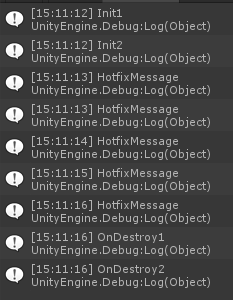

# Unity中通过AssetBundle+Xlua实现热更新  

热更新分为资源的热更新和脚本的热更新，可以通过AssetBundle更新资源文件，通过Xlua更新代码逻辑。

## Xlua  

1. 从<https://github.com/Tencent/xLua/>上下载Assets文件夹和Tools文件夹并导入至项目（Tools和Assets平级）,添加全局宏定义：***HOTFIX_ENABLE*** 和 ***INJECT_WITHOUT_TOOL***
2. 编写XLuaManager脚本并挂载在Camera上  

    ``` C#
    using System.Collections;
    using System.Collections.Generic;
    using System;
    using UnityEngine;
    using XLua;
    using LitJson;
    using System.IO;
    using System.Text;
    using UnityEngine.Networking;

    public class XLuaManager : MonoBehaviour
    {
        public static XLuaManager _Instance;

        internal static LuaEnv luaEnv = new LuaEnv(); //all lua behaviour shared one luaenv only!
        internal static float lastGCTime = 0;
        internal const float GCInterval = 1;//1 second

        private string LoaclLuaDic;

        private void Awake()
        {
            LoaclLuaDic = Path.Combine(Application.streamingAssetsPath, "Xlua", "LuaText");
            _Instance = this;
            StartCoroutine(CheckConfig());
        }

        private void Update()
        {
            if (Time.time - lastGCTime > GCInterval)
            {
                luaEnv.Tick();
                lastGCTime = Time.time;
            }
        }

        public void CreateLua(string luaText)
        {
            GameObject gp = new GameObject("lua instance");
            XLuaInstance li = gp.AddComponent<XLuaInstance>();
            li.Init(luaText);
        }

        private IEnumerator CheckConfig()
        {
            LuaConfig localLuaConfig = null;
            LuaConfig serverLuaConfig = null;
            int loadCount = 0;
            string localConfig = string.Empty;
            string serverConfig = string.Empty;
            StartCoroutine(GetText(Path.Combine(Application.streamingAssetsPath, "XLua", "XLuaLocalConfig.json"), (text) => { localConfig = text; loadCount++; }, true));
            StartCoroutine(GetText(Path.Combine(Application.streamingAssetsPath, "XLua", "XLuaSimulateServerConfig.json"), (text) => { serverConfig = text; loadCount++; }, false));

            while (loadCount < 2)
            {
                yield return null;
            }

            if (serverConfig != null)
            {
                serverLuaConfig = JsonMapper.ToObject<LuaConfig>(serverConfig);
            }

            if (serverLuaConfig == null)
            {
                Debug.LogWarning("服务器lua配置文件出错");
                yield break;
            }

            if (localConfig == null)
            {
                localLuaConfig = serverLuaConfig.Clone();
            }
            else
            {
                localLuaConfig = JsonMapper.ToObject<LuaConfig>(localConfig);
                if (localLuaConfig == null)
                {
                    localLuaConfig = serverLuaConfig.Clone();
                }
            }

            localLuaConfig.Update(serverLuaConfig, LoaclLuaDic);
            localLuaConfig.scriptList.Sort();
            StartCoroutine(LoadXlua(localLuaConfig));

            WriteTxt(Path.Combine(Application.streamingAssetsPath, "XLua", "XLuaLocalConfig.json"), JsonMapper.ToJson(localLuaConfig));
        }

        private IEnumerator LoadXlua(LuaConfig luaConfig)
        {
            foreach (var item in luaConfig.scriptList)
            {
                string[] temp = item.path.Split(new char[] { '/', '\\' });
                string name = temp[temp.Length - 1];
                if (File.Exists(Path.Combine(LoaclLuaDic, name)) == true)
                {
                    StartCoroutine(GetText(Path.Combine(LoaclLuaDic, name), (text) =>
                    {
                        item.luaText = text;
                        item.loadComlete = true;
                    }, true));
                }
                else
                {
                    StartCoroutine(GetText(item.path, (text) =>
                    {
                        WriteTxt(Path.Combine(LoaclLuaDic, name), text);
                        item.luaText = text;
                        item.loadComlete = true;
                    }, true));
                }
            }

            while (true)
            {
                yield return null;

                bool allComplete = true;

                foreach (var item in luaConfig.scriptList)
                {
                    if (item.loadComlete == false)
                    {
                        allComplete = false;
                    }
                }

                if (allComplete)
                {
                    break;
                }
            }

            foreach (var item in luaConfig.scriptList)
            {
                CreateLua(item.luaText);
            }
        }

        public bool WriteTxt(string _path, string _text)
        {
            FileStream fs = null;
            StreamWriter sw = null;

            try
            {
                fs = new FileStream(_path, FileMode.Create);
                sw = new StreamWriter(fs, Encoding.UTF8);
                sw.Write(_text);
                return true;
            }
            catch (Exception e)
            {
                Debug.Log(DateTime.Now.Date.ToShortTimeString() + ":" + e.Message);
                return false;
            }
            finally
            {
                if (sw != null)
                {
                    sw.Close();
                }
                if (fs != null)
                {
                    fs.Close();
                }
            }
        }

        public IEnumerator GetText(string url, Action<string> actionResult, bool removeBOM = false)
        {
            UnityWebRequest unityWebRequest = new UnityWebRequest(url)
            {
                downloadHandler = new DownloadHandlerBuffer()
            };

            yield return unityWebRequest.SendWebRequest();

            if (unityWebRequest.isNetworkError || unityWebRequest.isHttpError)
            {
                Debug.LogWarning(url + " 请求文本出错 " + unityWebRequest.error + "|" + unityWebRequest.downloadHandler.text);
                actionResult?.Invoke(null);
            }
            else
            {
                string text = unityWebRequest.downloadHandler.text;
                if (removeBOM)
                {
                    text = text.Substring(1);
                }
                actionResult?.Invoke(text);
            }
            unityWebRequest.Dispose();
        }

        private class LuaConfig
        {
            public List<LuaConfigElement> scriptList;

            public LuaConfig()
            {
                scriptList = new List<LuaConfigElement>();
            }

            private LuaConfigElement GetElementByPath(string _path)
            {
                foreach (var item in scriptList)
                {
                    if (item.path.Equals(_path))
                    {
                        return item;
                    }
                }
                return null;
            }

            public LuaConfig Clone()
            {
                LuaConfig copy = new LuaConfig();

                List<LuaConfigElement> copyScriptList = new List<LuaConfigElement>();

                foreach (var item in scriptList)
                {
                    copyScriptList.Add(item.Clone());
                }

                return copy;
            }
            
            public void Update(LuaConfig target, string dicPath)
            {
                //删除更新后不存在或者有新版本的对象
                for (int i = 0; i < scriptList.Count; i++)
                {
                    string[] temp = scriptList[i].path.Split(new char[] { '/', '\\' });
                    string name = temp[temp.Length - 1];

                    if (target.GetElementByPath(scriptList[i].path) == null)
                    {
                        DeleteFile(Path.Combine(dicPath, name));
                        scriptList.RemoveAt(i);
                        i--;
                    }
                    else
                    {
                        if (target.GetElementByPath(scriptList[i].path).version > scriptList[i].version)
                        {
                            DeleteFile(Path.Combine(dicPath, name));
                            scriptList.RemoveAt(i);
                            i--;
                        }
                    }
                }
                //添加需要更新的对象并更新仍然存在的对象
                for (int i = 0; i < target.scriptList.Count; i++)
                {
                    if (this.GetElementByPath(target.scriptList[i].path) == null)
                    {
                        this.scriptList.Add(target.scriptList[i].Clone());
                    }
                    else
                    {
                        LuaConfigElement crtElement = this.GetElementByPath(target.scriptList[i].path);
                        crtElement.order = target.scriptList[i].order;
                    }
                }
            }

            /// <summary>
            /// 删除文件
            /// </summary>
            /// <param name="_path"></param>
            /// <returns></returns>
            public static bool DeleteFile(string _path)
            {
                try
                {
                    File.Delete(_path);
                    return true;
                }
                catch (Exception)
                {
                    return false;
                }
            }

            public class LuaConfigElement : IComparable<LuaConfigElement>
            {
                public string path;
                public int version;
                public int order;

                [NonSerialized]
                public string luaText;
                [NonSerialized]
                public bool loadComlete;

                public LuaConfigElement()
                {
                    loadComlete = false;
                }

                public LuaConfigElement Clone()
                {
                    LuaConfigElement copy = new LuaConfigElement
                    {
                        path = this.path,
                        version = this.version,
                        order = this.order,
                        luaText = this.luaText,
                        loadComlete = this.loadComlete,
                    };

                    return copy;
                }

                public int CompareTo(LuaConfigElement obj)
                {
                    return obj.order.CompareTo(order);
                }

                public override string ToString()
                {
                    return $"path:{path},luaText:{luaText},order:{order}";
                }
            }
        }
    }
    ```

3. 编写XLuaInstance脚本用于挂载Lua实例

    ``` C#
    using System;
    using System.Collections;
    using System.Collections.Generic;
    using UnityEngine;
    using XLua;

    [LuaCallCSharp]
    public class XLuaInstance : MonoBehaviour
    {
        private Action luaUpdate;
        private Action luaOnDestroy;

        private LuaTable scriptEnv;

        private LuaEnv luaEnv;

        public void Init(string luaScript)
        {
            luaEnv = XLuaManager.luaEnv;
            scriptEnv = luaEnv.NewTable();

            // 为每个脚本设置一个独立的环境，可一定程度上防止脚本间全局变量、函数冲突
            LuaTable meta = luaEnv.NewTable();
            meta.Set("__index", luaEnv.Global);
            scriptEnv.SetMetaTable(meta);
            meta.Dispose();

            scriptEnv.Set("self", this);
            luaEnv.DoString(luaScript, "LuaTestScript", scriptEnv);

            Action luaAwake = scriptEnv.Get<Action>("Init");
            scriptEnv.Get("Update", out luaUpdate);
            scriptEnv.Get("OnDestroy", out luaOnDestroy);

            luaAwake?.Invoke();
        }

        void Update()
        {
            luaUpdate?.Invoke();
        }

        void OnDestroy()
        {
            luaOnDestroy?.Invoke();
            scriptEnv?.Dispose();
        }
    }
    ```

4. 编写脚本XLuaHotFixTest并挂载到新建空物体上

    ``` C#
    using System.Collections;
    using System.Collections.Generic;
    using UnityEngine;
    using XLua;

    [Hotfix]
    public class XLuaHotFixTest : MonoBehaviour
    {
        private void Update()
        {
            if (Time.frameCount % 50 == 0)
            {
                Debug.Log(GetMessage());
            }
        }

        public string GetMessage()
        {
            return "RawMessage";
        }
    }
    ```

5. 在StreamingAsset/XLua文件夹下新建文件XLuaSimulateServerConfig.json

    ``` json
    {
        "scriptList": [{
            "path": "F:/WorkSpace/NonsensicalHub/TonyLab/Assets/StreamingAssets/XLua/SeverLuaText/testLua1.txt",
            "version": 3,
            "order": 1000
        }, {
            "path": "F:/WorkSpace/NonsensicalHub/TonyLab/Assets/StreamingAssets/XLua/SeverLuaText/testLua2.txt",
            "version": 4,
            "order": 1000
        }]
    }
    ```

6. 在StreamingAsset/XLua/SeverLuaText文件夹下创建两个lua脚本  
    textLua1.txt

    ``` lua

    function Init()
        CS.UnityEngine.Debug.Log("Init1");
    end

    function Update()

    end

    function OnDestroy()
    CS.UnityEngine.Debug.Log("OnDestroy1");
    end

    ```

    testLua2.txt

    ``` lua

    function Init()
    CS.UnityEngine.Debug.Log("Init2");
    xlua.hotfix(CS.XLuaHotFixTest, 'GetMessage', function()
                        return 'HotfixMessage'
                    end)
    end

    function Update()

    end

    function OnDestroy()
    CS.UnityEngine.Debug.Log("OnDestroy2");
    end

    ```

7. 运行场景即可从控制台中看见debug日志  


8. 只需要修改或新增或减少StreamingAsset/XLua文件夹中的lua脚本，同时更新配置文件XLuaSimulateServerConfig.json，即可做到热更新（生产环境中这个文件夹和配置文件会放在服务器上）

## AssetBundle  

1. 使用和lua文件更新相同的思路把所有ab包文件下载到本地文件夹，这里不再赘述

2. 使用AssetBundleManger_Local脚本对ab包进行包括依赖的管理，当有新的ab包时，可以通过lua热更新来加载

``` C#
    /// <summary>
    /// 适用于所有ab包都在本地同一个文件夹内的情况
    /// </summary>
    public class AssetBundleManager_Local : MonoSingleton<AssetBundleManager_Local>
    {

        private string assetBundlePath;

        private Dictionary<string, AssetBundleInfo> assstBundleDic;

        private AssetBundleManifest assetBundleManifest;

        protected override void Awake()
        {
            base.Awake();

            assetBundlePath = Path.Combine(Application.streamingAssetsPath, "AssetBundles");

            InitAssetBundleManager(Path.Combine(assetBundlePath, "AssetBundles"));
        }

        /// <summary>
        /// 初始化管理类
        /// </summary>
        /// <param name="assetBundleManifestBundlePath"></param>
        public void InitAssetBundleManager(string assetBundleManifestBundlePath)
        {
            assstBundleDic = new Dictionary<string, AssetBundleInfo>();

            AssetBundle assetBundle = AssetBundle.LoadFromFile(assetBundleManifestBundlePath);
            assetBundleManifest = assetBundle.LoadAsset<AssetBundleManifest>("AssetBundleManifest");

            string[] bundles = assetBundleManifest.GetAllAssetBundlesWithVariant();

            foreach (var item in bundles)
            {
                assstBundleDic.Add(item, new AssetBundleInfo(item, assetBundleManifest.GetDirectDependencies(item)));
            }
        }

        /// <summary>
        /// 加载AB包
        /// </summary>
        /// <param name="_bundleName"></param>
        /// <param name="_onComplete"></param>
        /// <param name="_onLoading"></param>
        public void LoadAssetBundle(string _bundleName,Action _onComplete, Action<float> _onLoading = null)
        {
            if (assstBundleDic.ContainsKey(_bundleName) == false)
            {
                Debug.LogWarning($"错误的包名{_bundleName}");
                return;
            }
            if (assstBundleDic[_bundleName].AssetBundlePack == true)
            {
                _onComplete?.Invoke();
                return;
            }
            if (assstBundleDic[_bundleName].Loading == false)
            {
                StartCoroutine(LoadAssetBundleCoroutine(_bundleName, _onComplete, _onLoading));
            }
        }

        /// <summary>
        /// 加载Ab包协程
        /// </summary>
        /// <param name="_bundleName"></param>
        /// <param name="_onComplete"></param>
        /// <param name="_onLoading"></param>
        /// <returns></returns>
        private IEnumerator LoadAssetBundleCoroutine(string _bundleName,Action _onComplete, Action<float> _onLoading = null)
        {
            string[] dependencies = assstBundleDic[_bundleName].Dependencies;
            int completeCount = 0;
            foreach (var item in dependencies)
            {
                assstBundleDic[item].DependencieCount++;
                LoadAssetBundle(item,()=> { completeCount++; });
            }
            while (completeCount< dependencies.Length)
            {
                yield return null;
            }

            string bundlePath = Path.Combine(assetBundlePath, _bundleName);

            AssetBundleCreateRequest request = AssetBundle.LoadFromFileAsync(bundlePath);

            assstBundleDic[_bundleName].Loading = true;

            do
            {
                yield return null;

                _onLoading?.Invoke(request.progress);
            }
            while (request.progress < 1);

            if (request.assetBundle != null)
            {
                assstBundleDic[_bundleName].AssetBundlePack = request.assetBundle;
                assstBundleDic[_bundleName].Loading = false;
                assstBundleDic[_bundleName].OnLoadComplete?.Invoke();
                assstBundleDic[_bundleName].OnLoadComplete = null;
            }
            else
            {
                Debug.LogError($"AB包加载失败，路径：{bundlePath}");
            }
            _onComplete?.Invoke();
        }

        public void LoadResource<T>(string _resourcesNameOrPath, string _bundleName, Action<T> _onComplete) where T : UnityEngine.Object
        {
            if (assstBundleDic.ContainsKey(_bundleName) == false)
            {
                Debug.LogWarning($"错误的包名{_bundleName}");
                return;
            }

            if (assstBundleDic[_bundleName].AssetBundlePack != null)
            {
                assstBundleDic[_bundleName].LoadCount++;
                StartCoroutine(LoadResourceCoroutine<T>(_resourcesNameOrPath, assstBundleDic[_bundleName].AssetBundlePack, _onComplete));
            }
            else
            {
                assstBundleDic[_bundleName].OnLoadComplete += () =>
                {
                    assstBundleDic[_bundleName].LoadCount++;
                    StartCoroutine(LoadResourceCoroutine<T>(_resourcesNameOrPath, assstBundleDic[_bundleName].AssetBundlePack, _onComplete));
                };
                LoadAssetBundle(_bundleName,null);
            }
        }

        private IEnumerator LoadResourceCoroutine<T>(string _resourcesNameOrPath, AssetBundle _assetBundle, Action<T> _onComplete) where T : UnityEngine.Object
        {
            AssetBundleRequest assetBundleRequest = _assetBundle.LoadAssetAsync<T>(_resourcesNameOrPath);

            yield return assetBundleRequest;

            if (assetBundleRequest.asset != null)
            {
                T Object = assetBundleRequest.asset as T;
                _onComplete(Object);
            }
            else
            {
                Debug.LogError($"未加载到对象:{_resourcesNameOrPath}");
            }
        }

        public void ReleaseAsset(string _bundleName)
        {
            assstBundleDic[_bundleName].LoadCount--;
        }

        private class AssetBundleInfo
        {
            public string BundleName;   //包的名称
            public string[] Dependencies;       //直接依赖的包名称

            public AssetBundle AssetBundlePack; //ab包
            public int LoadCount = 0;           //包内对象加载的次数
            public int DependencieCount = 0;    //被依赖加载的次数
            public bool Loading;                //是否正在进行加载
            public Action OnLoadComplete;

            public AssetBundleInfo(string _bundleName, string[] _dependencies)
            {
                this.BundleName = _bundleName;
                this.Dependencies = _dependencies;
            }
        }
    }
```
