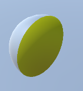
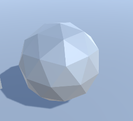
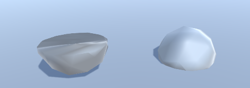

# Unity模型增减研究

## 模型的削减

### 模型的切割  

   模拟模型被电锯切割

1. 使用控制渲染的shader并使用脚本传入变量，进行模型的材质部分渲染（_已实现平面切割_）  
     
   优点：仅进行渲染的控制，对其他部分的影响较小，不容易出现奇怪的现象  
   缺点：切割断面没有mesh的点，无法渲染断面；mesh本身没有改变，无法自适应碰撞体  
   适用场景：仅仅需要显示效果，且断面为纯色的场合
2. 对模型进行mesh级的切割处理（_已实现平面切割（非凹切割面）_）  
   优点：完全的新模型，真实的碰撞体  
   缺点：由于对切割面上的点相应的法线是通过平均算出来的，会导致切割后模型显示效果差异（_面数较多的模型影响较小_），面数多时切割算法较为耗时  
   __棱角球切割前__  
     
   __棱角球切割后__  
     
   适用场景：对切割后碰撞体有需求，且对渲染需求不大的场合  
3. 使用渲染进行模型部分渲染，同时在断面上生成新的模型模拟断面（尚未实现）  

### 模型的切削

   模拟模型被车床切削

1. 设想1  
   求出切削模型和被切削模型所有的相交的三角面

## 模型的增加  

### 拼装式增加  

1. 预先准备好需要拼装的每一块模型,使用空点标记拼装位置来进行拼装  
   优点：  
   缺点：  
   使用场景：  
