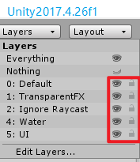
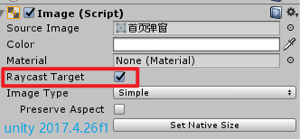
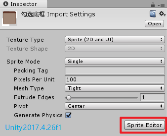
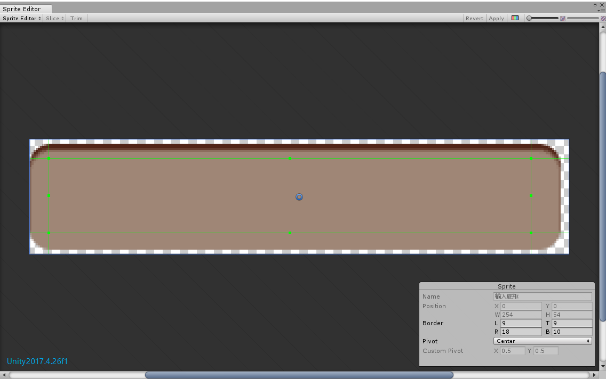
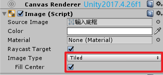

# Unity3d使用心得

    这里是一些小到不值得单独写文章，但是又非常有用的技巧的汇总

##### 小技巧

1. Editor
    * 当Scene视图中有一些物体不可见或者不可选时，可能跟layer的设置有关  

        >如下图，眼睛按钮代表是否可见，锁的按钮代表是否可选。  
        >
        >  

2. UGUI

    * 不需要进行交互的UI对象关闭Raycast Target选项以减少性能消耗  

        >  

    * 防止图片边框拉伸后变形  

        >选中要设置的图片，点击属性面板里的SpiteEditor按钮  
        >
        >  
        >
        >拖动绿色的线将非边框区域调整至中心区域，然后点击右上角的Apply按钮应用  
        >
        >  
        >
        >使用的Image要改变成Tiled类型并且FillCenter选项要勾选上(否则中心部分会空白)  
        >
        >  

