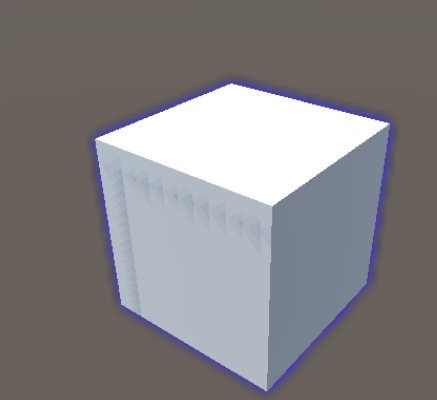
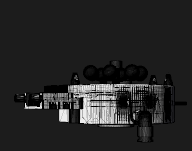

# 华科项目WebGL打包

## 测试  

DOTween:  

>DOTween - 简单测试可正常使用  

HighlightSystem:  

>HighlightSystem - 效果与预期不一致  
>高光插件在unity中测试的效果：  
>  
>高光插件打包到webgl后的效果：  
>

使用了引用Newtonsoft.Json库的脚本后会报两个错,报错内容如下：

>* NotSupportedException:D:\ProgramFiles\Unity\Editor\Data\il2cpp\libil2cpp\icalls\mscorlib\System.Reflection.Emit\DynamicMethod.cpp(19) : Unsupported internal call for IL2CPP:DynamicMethod::create_dynamic_method - System.Reflection.Emit is not supported.  
>* To use dlopen, you need to use Emscripten's linking support, see <https://github.com/kripken/emscripten/wiki/Linking>  
>网上查阅资料得知可能可以通过其专门为Unity准备的版本来规避这个问题，但是公司内网无法打开下载链接，遂无法测试  
>下载链接：<https://github.com/SaladLab/Json.Net.Unity3D/releases>  
>另外发现此库文件放置在HNC_OpenAI库文件夹里面，很有可能被其库文件调用  

下载新的库文件后，使用第一个反射的报错消失，但仍然存在另一个错误:  

>删除项目内所有包含DllImport代码的脚本以及相关的脚本后，编辑器内能正常运行，打包后报错仍然存在  
>删除项目内所有使用到了Thread的cs文件以及相关代码后，编辑器内能正常运行，打包后报错仍然存在  
>删除项目内所有使用连接用dll以及相关代码后，编辑器内能正常运行，打包后能正常运行初始场景，尝试加载StreamingAssets文件夹时报错卡死（需改成get形式读取）  
>将初始化话场景里的加载StreamingAssets文件夹内容的代码改成UnityWebRequest.Get后，编辑器内能正常运行，打包后初始场景正常运行且无报错，但不会加载进入主场景（编辑器环境下会加载，判断是内存消耗过大导致运行加载场景卡死）  

无视代码逻辑，强行进入主场景

>出现内存超出报警，程序强制关闭，无法打开

存在面数非常多的模型:  

>运行时单这个模型就占用了100多M内存:  
>

打包时没有去除加载时logo的选项
>在unity的WebGL平台的PlayerSetting中，并没有关闭去掉加载时Logo得选项，替换所有图片文件仍然无法替换logo，查阅相关资料得知需要在js中重写unity的相关方法来自己制作网页中的加载动画

## 解决方案  

1. 使用美工提供减面后的模型  
多面的模型会占用较多的运行内存，为了适应webgl平台对内存的要求，应当抛弃一部分显示效果，使用减面后的模型  
2. 对贴图进行压缩，Mip Maps不必要时应当不适用  
对贴图进行压缩可以有效降低内存消耗，合理使用Mip Maps可以有效减小显存消耗，但是当其不会产生作用时（场景较小时或者一直和摄像机保持较近距离的模型贴图），会占用多余的内存
3. 不使用过于复杂的光效，特别是反射效果  
关闭所有灯光，仅使用物体自带光照贴图，可以使得在效果能够的范围内有效减少光照贴图的内存消耗
4. 自己编写webgl打包模板  
在网上查阅相关资料，编写一个html模板来在playerSetting中使用，就可以自定义加载动画了

## 可优化手段  

1. 将模型调回正常的比例  
现场景中物体的比例为1比10，在进行高配置光效烘焙时，需要烘焙5-6个小时，且在运行时有2g以上的内存用于加载光效贴图，经测试当模型比例正常时，消耗会大大减少，所以为了提高性能，应当使用1比1的比例来搭建场景
2. 全部使用减面后的模型
由于机器人新旧模型节点旋转不同，以及部分模型新旧模型节点数量不同且使用了动画，所以无法替换成新的减面模型，可以将这部分模型相关脚本和动画重新制作并替换模型来优化性能问题

## 仍需解决问题  

1. 连接需要改用WebSocket  
由于是离线项目，所以连接代码相关直接删除，可以越过相关代码直接打包，但是当做成虚实结合项目时，所有的连接都必须做成WebSocket连接，但是与机器的连接相关代码是在第三方的dll中的，所以做成虚实结合很可能需要第三方进行技术支持
